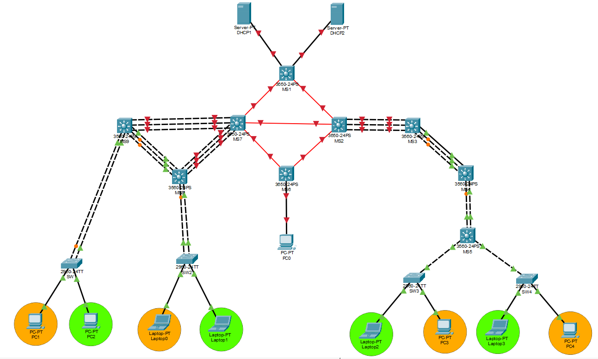

# Manual Técnico - Proyecto 1

## Tabla de Contenidos
- [Manual Técnico - Proyecto 1](#manual-técnico---proyecto-1)
  - [Tabla de Contenidos](#tabla-de-contenidos)
  - [1. Objetivos](#1-objetivos)
    - [1.1 Objetivo General](#11-objetivo-general)
    - [1.2 Objetivos Específicos](#12-objetivos-específicos)
  - [2. Alcance del Proyecto](#2-alcance-del-proyecto)
    - [2.1 Inclusiones](#21-inclusiones)
    - [2.2 Exclusiones](#22-exclusiones)
  - [3. Topología de Red](#3-topología-de-red)
  - [4. Tabla de Conexiones de la Red](#4-tabla-de-conexiones-de-la-red)
  - [5. Tabla de Direccionamiento IP](#5-tabla-de-direccionamiento-ip)
    - [5.1 Direcciones de Dispositivos en Enrutamiento](#51-direcciones-de-dispositivos-en-enrutamiento)
    - [5.2 Direcciones de Dispositivos Finales](#52-direcciones-de-dispositivos-finales)
  - [6. Subnetting](#6-subnetting)
    - [6.1 VLANs (192.188.20.0/24 - VLSM)](#61-vlans-19218820024---vlsm)
      - [Tabla de Subredes por VLAN](#tabla-de-subredes-por-vlan)
    - [6.2 Enlaces de Enrutamiento (10.4.20.0/24 - FLSM /30)](#62-enlaces-de-enrutamiento-10420024---flsm-30)
  - [7. Configuraciones de Dispositivos](#7-configuraciones-de-dispositivos)
    - [7.1 Configuraciones de Dispositivos de Red MAN](#71-configuraciones-de-dispositivos-de-red-man)
      - [7.1.1 Configuración MS1](#711-configuración-ms1)
      - [7.1.2 Configuración MS2](#712-configuración-ms2)
      - [7.1.3 Configuración MS6](#713-configuración-ms6)
      - [7.1.4 Configuración MS7](#714-configuración-ms7)
    - [7.2 Configuración de Dispositivos de Edificio Izquierdo](#72-configuración-de-dispositivos-de-edificio-izquierdo)
      - [7.2.1 Configuración MS8](#721-configuración-ms8)
      - [7.2.2 Configuración MS9](#722-configuración-ms9)
      - [7.2.3 Configuración SW1](#723-configuración-sw1)
      - [7.2.4 Configuración SW2](#724-configuración-sw2)
    - [7.3 Configuraciones de Dispositivos de Edificio Derecho](#73-configuraciones-de-dispositivos-de-edificio-derecho)
      - [7.3.1 Configuración MS3](#731-configuración-ms3)
      - [7.3.2 Configuración MS4](#732-configuración-ms4)
      - [7.3.2 Configuración MS5](#732-configuración-ms5)
      - [7.3.3 Configuración SW3](#733-configuración-sw3)
      - [7.3.4 Configuración SW4](#734-configuración-sw4)
    - [7.4 Configuración de Servidores DHCP](#74-configuración-de-servidores-dhcp)
      - [7.4.1 Configuración de Servidor DHCP 1 (Edificio Izquierdo y ADMIN)](#741-configuración-de-servidor-dhcp-1-edificio-izquierdo-y-admin)
        - [Configuración de Pools DHCP](#configuración-de-pools-dhcp)
      - [7.4.2 Configuración de Servidor DHCP 2 (Edificio Derecho)](#742-configuración-de-servidor-dhcp-2-edificio-derecho)
        - [Configuración de Pools DHCP](#configuración-de-pools-dhcp-1)
  - [8. Listas de Control de Acceso (ACLs)](#8-listas-de-control-de-acceso-acls)
    - [8.1 ACLs en el Edificio Izquierdo (Configurado en MS7)](#81-acls-en-el-edificio-izquierdo-configurado-en-ms7)
    - [8.2 ACLs en el Edificio Derecho (Configurado en MS3)](#82-acls-en-el-edificio-derecho-configurado-en-ms3)

---

## 1. Objetivos

### 1.1 Objetivo General
Diseñar, configurar y simular una infraestructura de red empresarial multi-edificio para la organización Chapin Red utilizando Cisco Packet Tracer. El diseño busca garantizar una comunicación segura, eficiente y redundante entre los cuatro edificios de la organización, implementando segmentación de red mediante VLANs, protocolos de enrutamiento dinámico, alta disponibilidad mediante agregación de enlaces y políticas de control de acceso.

### 1.2 Objetivos Específicos
* **Segmentar** la red de cada edificio en VLANs diferenciadas por departamento (VLAN Naranja, VLAN Verde y VLAN ADMIN) para separar el tráfico y mejorar la seguridad.
* **Implementar** un esquema de direccionamiento IP jerárquico utilizando VLSM sobre la red 192.188.20.0/24 para las VLANs y FLSM con subredes /30 sobre la red 10.4.20.0/24 para los enlaces de enrutamiento.
* **Configurar** enrutamiento inter-VLAN e inter-edificios mediante el protocolo OSPF para garantizar la comunicación entre todas las sedes.
* **Establecer** una arquitectura jerárquica de tres capas (Core, Distribución y Acceso) en el edificio izquierdo, garantizando escalabilidad y rendimiento.
* **Implementar** agregación de enlaces con LACP (5 enlaces en el edificio izquierdo) y PAgP (3 enlaces en el edificio derecho) para alta disponibilidad y redundancia.
* **Configurar** el protocolo VTP para la sincronización de VLANs entre switches, designando roles de servidor y cliente según la topología.
* **Implementar** Spanning Tree Protocol (STP) en todos los dispositivos de capa 2 para prevenir bucles de red.
* **Configurar** servidores DHCP centralizados (uno por edificio) con DHCP Relay para la asignación dinámica de direcciones IP a todos los dispositivos finales.
* **Aplicar** políticas de control de acceso mediante ACLs para restringir la comunicación entre VLANs según los requerimientos de seguridad de la organización.
* **Validar** la tolerancia a fallos desconectando puertos de los canales agregados y verificando que no se produzca pérdida de paquetes.

---

## 2. Alcance del Proyecto

### 2.1 Inclusiones
* El diseño, configuración y validación se realizan en el simulador **Cisco Packet Tracer**.
* La topología abarca la interconexión de **cuatro edificios** de Chapin Red mediante una red de área metropolitana (MAN) con fibra óptica.
* Configuración de tecnologías de Capa 2 y Capa 3, incluyendo VLANs, VTP, STP, enrutamiento inter-VLAN, OSPF, LACP, PAgP y ACLs.
* Implementación de una **arquitectura jerárquica de tres capas** (Core, Distribución y Acceso) en el edificio principal izquierdo.
* Asignación de direccionamiento IP y configuración de todos los dispositivos mediante la **Interfaz de Línea de Comandos (CLI)**.
* Configuración de **servidores DHCP** para asignación dinámica de IPs a dispositivos finales (PCs y laptops).
* Implementación de **DHCP Relay** (ip helper-address) en los switches multicapa para reenvío de solicitudes DHCP entre subredes.
* Pruebas de **tolerancia a fallos** en los canales de agregación LACP y PAgP.

### 2.2 Exclusiones
* La conexión de la red con redes externas como WAN o Internet.
* La implementación de mecanismos de seguridad avanzados más allá de las ACLs estándar/extendidas requeridas.
* El uso de direcciones IP estáticas en dispositivos finales (PCs y laptops).
* El uso de interfaces gráficas de usuario (GUI) para la configuración de los dispositivos.
* Configuración de servicios adicionales como DNS o servidores web.

---

## 3. Topología de Red
A continuación se presenta el diagrama de la topología de red implementada en Cisco Packet Tracer para el proyecto Chapin Red. La red interconecta cuatro edificios mediante una red MAN con fibra óptica (módulos Gigabit), con un switch multicapa Cisco 3650 como punto de interconexión central. El enrutamiento inter-edificios se realiza mediante el protocolo OSPF (carné par: 202302220).



---

## 4. Tabla de Conexiones de la Red

|  Switch      |Interfaz1|  Switch/PC 1  |Interfaz2|
|--------------|---------|---------------|---------|
| MS1          | Gi1/0/1 | DHCP1         | fa0     |
| MS1          | Gi1/0/2 | DHCP2         | fa0     |
| MS1          | Gi1/1/1 | MS7           | Gi1/1/1 |
| MS1          | Gi1/1/4 | MS2           | Gi1/1/4 |
| MS2          | Gi1/1/2 | MS7           | Gi1/1/4 |
| MS6          | Gi1/1/2 | MS7           | Gi1/1/2 |
| MS6          | Gi1/1/3 | MS2           | Gi1/1/3 |
| MS6          | Gi1/0/1 | PC0           | fa0     |
| MS9          | fa0/1   | MS7           | Gi1/0/1 |
| MS9          | fa0/2   | MS7           | Gi1/0/2 |
| MS9          | fa0/3   | MS7           | Gi1/0/3 |
| MS8          | fa0/4   | MS7           | Gi1/0/4 |
| MS8          | fa0/5   | MS7           | Gi1/0/5 |
| MS8          | fa0/6   | MS7           | Gi1/0/6 |
| MS9          | fa0/7   | MS8           | fa0/7   |
| MS9          | fa0/8   | MS8           | fa0/8   |
| MS9          | fa0/9   | MS8           | fa0/9   |
| MS9          | fa0/23  | Switch2       | fa0/23  |
| MS9          | fa0/24  | Switch2       | fa0/24  |
| MS8          | fa0/23  | Switch1       | fa0/23  |
| MS8          | fa0/24  | Switch1       | fa0/24  |
| SW1          | fa0/1   | PC1           | fa0     | 
| SW1          | fa0/2   | PC2           | fa0     |
| SW2          | fa0/1   | Laptop0       | fa0     | 
| SW2          | fa0/2   | Laptop1       | fa0     |
| MS3          | fa0/22  | MS2           | gi1/0/22|
| MS3          | fa0/23  | MS2           | gi1/0/23|
| MS3          | fa0/24  | MS2           | gi1/0/24|
| MS3          | fa0/1   | MS4           | fa0/1   |
| MS3          | fa0/2   | MS4           | fa0/2   |
| MS3          | fa0/3   | MS4           | fa0/3   |
| MS4          | fa0/23  | MS5           | fa0/23  |
| MS4          | fa0/24  | MS5           | fa0/24  |
| MS5          | fa0/3   | SW3           | fa0/3   |
| MS5          | fa0/4   | SW4           | fa0/4   |
| SW3          | fa0/1   | Laptop2       | fa0     |
| SW3          | fa0/2   | PC3           | fa0     |
| SW4          | fa0/1   | Laptop3       | fa0     |
| SW4          | fa0/2   | PC4           | fa0     |


## 5. Tabla de Direccionamiento IP

### 5.1 Direcciones de Dispositivos en Enrutamiento

| Dispositivo | Enlace | Dirección IP | Máscara de Red |
|-------------|--------|--------------|----------------|
| MS1 (MAN Arriba) | MS1 ↔ MS7 | 10.4.20.1 | 255.255.255.252 |
| MS7 (MAN Izq) | MS1 ↔ MS7 | 10.4.20.2 | 255.255.255.252 |
| MS1 (MAN Arriba) | MS1 ↔ MS2 | 10.4.20.5 | 255.255.255.252 |
| MS2 (MAN Der) | MS1 ↔ MS2 | 10.4.20.6 | 255.255.255.252 |
| MS7 (MAN Izq) | MS7 ↔ MS2 | 10.4.20.9 | 255.255.255.252 |
| MS2 (MAN Der) | MS7 ↔ MS2 | 10.4.20.10 | 255.255.255.252 |
| MS7 (MAN Izq) | MS7 ↔ MS6 | 10.4.20.13 | 255.255.255.252 |
| MS6 (MAN Abajo) | MS7 ↔ MS6 | 10.4.20.14 | 255.255.255.252 |
| MS2 (MAN Der) | MS2 ↔ MS6 | 10.4.20.17 | 255.255.255.252 |
| MS6 (MAN Abajo) | MS2 ↔ MS6 | 10.4.20.18 | 255.255.255.252 |
| MS7 (MAN Izq) | MS7 ↔ MS9 | 10.4.20.21 | 255.255.255.252 |
| MS9 (Core Izq) | MS7 ↔ MS9 | 10.4.20.22 | 255.255.255.252 |
| MS2 (MAN Der) | MS2 ↔ MS3 | 10.4.20.25 | 255.255.255.252 |
| MS3 (Core Der) | MS2 ↔ MS3 | 10.4.20.26 | 255.255.255.252 |
| MS1 (MAN Arriba)| MS1 ↔ DHCP1 | 10.4.20.29| 255.255.255.252 |
| DHCP1 | MS1 ↔ DHCP1 | 10.4.20.30 | 255.255.255.252 |
| MS1 (MAN Arriba)| MS1 ↔ DHCP2 | 10.4.20.33 | 255.255.255.252 |
| DHCP2 | MS1 ↔ DHCP2 | 10.4.20.34 | 255.255.255.252 |


### 5.2 Direcciones de Dispositivos Finales


| Dispositivo | VLAN | ID Red | Default Gateway (IP SVI) | IP Asignada por DHCP (Ejemplo) |
|---|---|---|---|---|
| PC1 | 10 (Naranja Izq) | 192.188.20.0/29 | 192.188.20.1 | 192.188.20.2 |
| Laptop0 | 10 (Naranja Izq) | 192.188.20.0/29 | 192.188.20.1 | 192.188.20.3 |
| PC2 | 20 (Verde Izq) | 192.188.20.8/29 | 192.188.20.9 | 192.188.20.10 |
| Laptop1 | 20 (Verde Izq) | 192.188.20.8/29 | 192.188.20.9 | 192.188.20.11 |
| PC3 | 30 (Naranja Der) | 192.188.20.16/29 | 192.188.20.17 | 192.188.20.18 |
| PC4 | 30 (Naranja Der) | 192.188.20.16/29 | 192.188.20.17 | 192.188.20.19 |
| Laptop2 | 40 (Verde Der) | 192.188.20.24/29 | 192.188.20.25 | 192.188.20.26 |
| Laptop3 | 40 (Verde Der) | 192.188.20.24/29 | 192.188.20.25 | 192.188.20.27 |
| PC ADMIN (PC0) | 99 (ADMIN) | 192.188.20.32/30 | 192.188.20.33 | 192.188.20.34 |

## 6. Subnetting

### 6.1 VLANs (192.188.20.0/24 - VLSM)

La red **192.188.20.0/24** se divide en cinco subredes mediante VLSM, una por cada VLAN:

#### Tabla de Subredes por VLAN

| Hosts Necesarios | VLAN | Departamento | ID Red | Máscara | Wildcard | Primer Host | Último Host | Broadcast | Hosts Utilizables |
|:---:|:---:|:---|:---:|:---:|:---:|:---:|:---:|:---:|:---:|
| 3 (/29) | 10 | Naranja – Edificio Izq. | 192.188.20.0 | 255.255.255.248 | 0.0.0.7 | 192.188.20.1 | 192.188.20.6 | 192.188.20.7 | 6 |
| 3 (/29) | 20 | Verde – Edificio Izq. | 192.188.20.8 | 255.255.255.248 | 0.0.0.7 | 192.188.20.9 | 192.188.20.14 | 192.188.20.15 | 6 |
| 3 (/29) | 30 | Naranja – Edificio Der. | 192.188.20.16 | 255.255.255.248 | 0.0.0.7 | 192.188.20.17 | 192.188.20.22 | 192.188.20.23 | 6 |
| 3 (/29) | 40 | Verde – Edificio Der. | 192.188.20.24 | 255.255.255.248 | 0.0.0.7 | 192.188.20.25 | 192.188.20.30 | 192.188.20.31 | 6 |
| 2 (/30) | 99 | ADMIN – Edificio Admin. | 192.188.20.32 | 255.255.255.252 | 0.0.0.3 | 192.188.20.33 | 192.188.20.34 | 192.188.20.35 | 2 |

### 6.2 Enlaces de Enrutamiento (10.4.20.0/24 - FLSM /30)

La red **10.4.20.0/24** se divide en subredes /30 (4 IPs por enlace) para los enlaces punto a punto entre switches multicapa:

| HOSTS NECESARIOS | Dispositivo A | Dispositivo B | ID RED | MÁSCARA | WILDCARD | PRIMER HOST | ÚLTIMO HOST | BROADCAST | HOSTS UTILIZABLES | HOSTS UTILIZADOS | DESPERDICIO |
|-----------------|---------------|---------------|--------|---------|----------|-------------|-------------|-----------|-------------------|------------------|-------------|
| 2 | MS1 (MAN Arriba) | MS7 (MAN Izq) | 10.4.20.0 | 255.255.255.252 | 0.0.0.3 | 10.4.20.1 | 10.4.20.2 | 10.4.20.3 | 2 | 2 | 0 |
| 2 | MS1 (MAN Arriba) | MS2 (MAN Der) | 10.4.20.4 | 255.255.255.252 | 0.0.0.3 | 10.4.20.5 | 10.4.20.6 | 10.4.20.7 | 2 | 2 | 0 |
| 2 | MS7 (MAN Izq) | MS2 (MAN Der) | 10.4.20.8 | 255.255.255.252 | 0.0.0.3 | 10.4.20.9 | 10.4.20.10 | 10.4.20.11 | 2 | 2 | 0 |
| 2 | MS7 (MAN Izq) | MS6 (MAN Abajo) | 10.4.20.12 | 255.255.255.252 | 0.0.0.3 | 10.4.20.13 | 10.4.20.14 | 10.4.20.15 | 2 | 2 | 0 |
| 2 | MS2 (MAN Der) | MS6 (MAN Abajo) | 10.4.20.16 | 255.255.255.252 | 0.0.0.3 | 10.4.20.17 | 10.4.20.18 | 10.4.20.19 | 2 | 2 | 0 |
| 2 | MS7 (MAN Izq) | MS9 (Core Izq) | 10.4.20.20 | 255.255.255.252 | 0.0.0.3 | 10.4.20.21 | 10.4.20.22 | 10.4.20.23 | 2 | 2 | 0 |
| 2 | MS2 (MAN Der) | MS3 (Core Der) | 10.4.20.24 | 255.255.255.252 | 0.0.0.3 | 10.4.20.25 | 10.4.20.26 | 10.4.20.27 | 2 | 2 | 0 |
| 2 | MS1 (MAN Arriba) | DHCP1 | 10.4.20.28 | 255.255.255.252 | 0.0.0.3 | 10.4.20.29 | 10.4.20.30 | 10.4.20.31 | 2 | 2 | 0 |
| 2 | MS1 (MAN Arriba) | DHCP2 | 10.4.20.32 | 255.255.255.252 | 0.0.0.3 | 10.4.20.33 | 10.4.20.34 | 10.4.20.35 | 2 | 2 | 0 |


> **Nota:** Se optó por utilizar enlaces enrutados (/30) de la red 10.4.20.0/24 para los servidores DHCP ya que garantiza una separación lógica a nivel de Capa 3 directamente desde el anillo MAN, facilitando la inyección de rutas en OSPF y el uso del DHCP Relay.
---

## 7. Configuraciones de Dispositivos

### 7.1 Configuraciones de Dispositivos de Red MAN

#### 7.1.1 Configuración MS1

```bash
enable
configure terminal
hostname MS1

! 1. Encender el enrutamiento IPv4 en el switch multicapa
ip routing

! 2. Configurar la interfaz hacia MS7
interface GigabitEthernet1/1/1
 no switchport
 ip address 10.4.20.1 255.255.255.252
 no shutdown
 exit

! 3. Configurar la interfaz hacia MS2
interface GigabitEthernet1/1/4
 no switchport
 ip address 10.4.20.5 255.255.255.252
 no shutdown
 exit

! 4. Levantar el protocolo OSPF
router ospf 1
 network 10.4.20.0 0.0.0.3 area 0
 network 10.4.20.4 0.0.0.3 area 0
 exit


! 5. Hacia Server DHCP 1
interface GigabitEthernet1/0/1
 no switchport
 ip address 10.4.20.29 255.255.255.252
 no shutdown
 exit

! 6. Hacia Server DHCP 2
interface GigabitEthernet1/0/2
 no switchport
 ip address 10.4.20.33 255.255.255.252
 no shutdown
 exit

! 7. Agregar estas redes a OSPF para que toda la red conozca el camino a los servidores
router ospf 1
 network 10.4.20.28 0.0.0.3 area 0
 network 10.4.20.32 0.0.0.3 area 0
 exit

end
write memory
```


#### 7.1.2 Configuración MS2

```bash
enable
configure terminal
hostname MS2

! 1. Encender enrutamiento
ip routing

! 2. Hacia MS1
interface GigabitEthernet1/1/4
 no switchport
 ip address 10.4.20.6 255.255.255.252
 no shutdown
 exit

! 3. Hacia MS7
interface GigabitEthernet1/1/2
 no switchport
 ip address 10.4.20.10 255.255.255.252
 no shutdown
 exit

! 4. Hacia MS6
interface GigabitEthernet1/1/3
 no switchport
 ip address 10.4.20.17 255.255.255.252
 no shutdown
 exit

! 5. PAgP Hacia MS3 (Port-Channel 6 Capa 3) - Velocidad a 100Mbps
interface range GigabitEthernet1/0/22 - 24
 no switchport
 speed 100
 channel-protocol pagp
 channel-group 6 mode desirable
 no shutdown
 exit

! 6. Asignar IP al Port-Channel 6
interface Port-channel 6
 ip address 10.4.20.25 255.255.255.252
 no shutdown
 exit

! 7. OSPF
router ospf 1
 network 10.4.20.4 0.0.0.3 area 0
 network 10.4.20.8 0.0.0.3 area 0
 network 10.4.20.16 0.0.0.3 area 0
 network 10.4.20.24 0.0.0.3 area 0
 exit

! 8. Configuración VTP (Modo Cliente)
vtp version 2
vtp mode client
vtp domain chapinred
vtp password redes2
end

write memory

```


#### 7.1.3 Configuración MS6

```bash
enable
configure terminal
hostname MS6

! 1. Encender el IP routing
ip routing

! 2. Hacia MS7
interface GigabitEthernet1/1/2
 no switchport
 ip address 10.4.20.14 255.255.255.252
 no shutdown
 exit

! 3. Hacia MS2
interface GigabitEthernet1/1/3
 no switchport
 ip address 10.4.20.18 255.255.255.252
 no shutdown
 exit

! 4. OSPF
router ospf 1
 network 10.4.20.12 0.0.0.3 area 0
 network 10.4.20.16 0.0.0.3 area 0
 exit

! 5. PREPARACIÓN VLAN ADMIN 
vlan 99
 name VLAN_ADMIN_EdificioADMIN_202302220
 exit

! 6. Asignar el puerto de la PC a la VLAN
interface GigabitEthernet1/0/1
 switchport mode access
 switchport access vlan 99
 exit
 

! 7. SVI para Gateway ADMIN (NO lleva DHCP Relay porque debe ser estática o configurarse un pool local, el proyecto prohíbe IPs estáticas en finales, así que lo configuraremos desde los servidores principales).
interface Vlan99
 ip address 192.188.20.33 255.255.255.252
 ! Apunta a DHCP1 por cercanía
 ip helper-address 10.4.20.30 
 no shutdown
 exit

! 8. Inyectar red a OSPF
router ospf 1
 network 192.188.20.32 0.0.0.3 area 0
 exit

end
write memory

```


#### 7.1.4 Configuración MS7

```bash
enable
configure terminal
hostname MS7

! 1. Encender el enrutamiento
ip routing

! 2. Configurar la interfaz hacia MS1
interface GigabitEthernet1/1/1
 no switchport
 ip address 10.4.20.2 255.255.255.252
 no shutdown
 exit

! 3. Configurar la interfaz hacia MS2
interface GigabitEthernet1/1/4
 no switchport
 ip address 10.4.20.9 255.255.255.252
 no shutdown
 exit

! 4. Configurar la interfaz hacia MS6
interface GigabitEthernet1/1/2
 no switchport
 ip address 10.4.20.13 255.255.255.252
 no shutdown
 exit

! 5. Levantar el protocolo OSPF
router ospf 1
 network 10.4.20.0 0.0.0.3 area 0
 network 10.4.20.8 0.0.0.3 area 0
 network 10.4.20.12 0.0.0.3 area 0
 exit


! 6. LACP Hacia MS9 (Port-Channel 1)
interface range GigabitEthernet1/0/1 - 3
 channel-protocol lacp
 channel-group 1 mode active
 switchport mode trunk
 exit

! 7. LACP Hacia MS8 (Port-Channel 2) 
interface range GigabitEthernet1/0/4 - 6
 channel-protocol lacp
 channel-group 2 mode active
 switchport mode trunk
 exit


! 8. Habilitar modo Rapid PVST
spanning-tree mode rapid-pvst
spanning-tree vlan 10,20 root primary
exit


! 9. Configuración VTP (Modo Servidor)
configure terminal
vtp version 2
vtp mode server
vtp domain chapinred
vtp password redes2


! 10. Creación de VLANs del Edificio Izquierdo
vlan 10
 name VLAN_Naranja_EdificioIZQ_202302220
vlan 20
 name VLAN_Verde_EdificioIZQ_202302220
exit


! 11. Creación de SVI para Gateways y DHCP Relay
interface Vlan10
 ip address 192.188.20.1 255.255.255.248
 ! Apunta al DHCP1
 ip helper-address 10.4.20.30  
 no shutdown
 exit

interface Vlan20
 ip address 192.188.20.9 255.255.255.248
 ip helper-address 10.4.20.30
 no shutdown
 exit

! 12. Inyectar redes a OSPF
router ospf 1
 network 192.188.20.0 0.0.0.7 area 0
 network 192.188.20.8 0.0.0.7 area 0
 exit

end
write memory

```


### 7.2 Configuración de Dispositivos de Edificio Izquierdo


#### 7.2.1 Configuración MS8

```bash
enable
configure terminal
hostname MS8

! 1. LACP Hacia MS7 (Port-Channel 2)
interface range FastEthernet0/4 - 6
 channel-protocol lacp
 channel-group 2 mode passive
 switchport trunk encapsulation dot1q
 switchport mode trunk
 exit

! 2. LACP Hacia MS9 (Port-Channel 3)
interface range FastEthernet0/7 - 9
 channel-protocol lacp
 channel-group 3 mode passive
 switchport trunk encapsulation dot1q
 switchport mode trunk
 exit


! 3. LACP Hacia SW1 (Port-Channel 5)
interface range FastEthernet0/23 - 24
 channel-protocol lacp
 channel-group 5 mode active
 switchport trunk encapsulation dot1q
 switchport mode trunk
 exit

! 4. Configuración de rapid-pvst
spanning-tree mode rapid-pvst
spanning-tree vlan 10,20 root secondary
exit

! 5. Configuración VTP (Modo Cliente)
configure terminal
vtp version 2
vtp mode client
vtp domain chapinred
vtp password redes2
end

write memory

```


#### 7.2.2 Configuración MS9

```bash
enable
configure terminal
hostname MS9

! 1. LACP Hacia MS7 (Port-Channel 1)
interface range FastEthernet0/1 - 3
 channel-protocol lacp
 channel-group 1 mode passive
 switchport trunk encapsulation dot1q
 switchport mode trunk
 exit

! 2. LACP Hacia MS8 (Port-Channel 3) 
interface range FastEthernet0/7 - 9
 channel-protocol lacp
 channel-group 3 mode active
 switchport trunk encapsulation dot1q
 switchport mode trunk
 exit

! 3. LACP Hacia SW2 (Port-Channel 4)
interface range FastEthernet0/23 - 24
 channel-protocol lacp
 channel-group 4 mode active
 switchport trunk encapsulation dot1q
 switchport mode trunk
 exit

! 4. Configuración de rapid-pvst
spanning-tree mode rapid-pvst
spanning-tree vlan 10,20 root secondary
exit

! 5. Configuración VTP (Modo Cliente)
configure terminal
vtp version 2
vtp mode client
vtp domain chapinred
vtp password redes2
end

write memory

```

#### 7.2.3 Configuración SW1

```bash
enable
configure terminal
hostname SW1


! 1. LACP Hacia MS8 (Port-Channel 5)
interface range FastEthernet0/23 - 24
 channel-protocol lacp
 channel-group 5 mode passive
 switchport mode trunk
 exit

! 2. Configuración de rapid-pvst
spanning-tree mode rapid-pvst
exit


! 3. Configuración VTP (Modo Cliente)
configure terminal
vtp version 2
vtp mode client
vtp domain chapinred
vtp password redes2
exit


! 4. Asignación de puerto para PC1 (VLAN Naranja)
configure terminal
interface FastEthernet0/1
 switchport mode access
 switchport access vlan 10
 exit


! 5. Asignación de puerto para PC2 (VLAN Verde)
interface FastEthernet0/2
 switchport mode access
 switchport access vlan 20
 exit

end
write memory

```


#### 7.2.4 Configuración SW2

```bash
enable
configure terminal
hostname SW2

! 1. LACP Hacia MS9 (Port-Channel 4)
interface range FastEthernet0/23 - 24
 channel-protocol lacp
 channel-group 4 mode passive
 switchport mode trunk
 exit

! 2. Configuración de rapid-pvst
spanning-tree mode rapid-pvst
exit

! 3. Configuración VTP (Modo Cliente)
configure terminal
vtp version 2
vtp mode client
vtp domain chapinred
vtp password redes2


! 4. Asignación de puerto para Laptop0 (VLAN Naranja)
interface FastEthernet0/1
 switchport mode access
 switchport access vlan 10
 exit

! 5. Asignación de puerto para Laptop1 (VLAN Verde)
interface FastEthernet0/2
 switchport mode access
 switchport access vlan 20
 exit

end
write memory

```


### 7.3 Configuraciones de Dispositivos de Edificio Derecho

#### 7.3.1 Configuración MS3  

```bash
enable
configure terminal
hostname MS3

! 1. Encender enrutamiento
ip routing

! 2. PAgP Hacia MS2 (Port-Channel 6 Capa 3)
interface range FastEthernet0/22 - 24
 no switchport
 channel-protocol pagp
 channel-group 6 mode auto
 no shutdown
 exit

! 3. Asignar IP al Port-Channel 6
interface Port-channel 6
 ip address 10.4.20.26 255.255.255.252
 no shutdown
 exit

! 4. PAgP Hacia MS4 (Port-Channel 7 Capa 2)
interface range FastEthernet0/1 - 3
 channel-protocol pagp
 channel-group 7 mode desirable
 switchport trunk encapsulation dot1q
 switchport mode trunk
 no shutdown
 exit

! 5. Configuración de rapid-pvst (Root Primary)
spanning-tree mode rapid-pvst
spanning-tree vlan 30,40 root primary

! 6. Configuración VTP (Modo Servidor)
vtp version 2
vtp mode server
vtp domain chapinred
vtp password redes2

! 7. Creación de VLANs del Edificio Derecho
vlan 30
 name VLAN_Naranja_EdificioDER_202302220
vlan 40
 name VLAN_Verde_EdificioDER_202302220
exit

! 8. Creación de SVI para Gateways y DHCP Relay
interface Vlan30
 ip address 192.188.20.17 255.255.255.248
 ip helper-address 10.4.20.34
 no shutdown
 exit

interface Vlan40
 ip address 192.188.20.25 255.255.255.248
 ip helper-address 10.4.20.34
 no shutdown
 exit

! 9. Configurar OSPF en MS3
router ospf 1
 network 10.4.20.24 0.0.0.3 area 0
 network 192.188.20.16 0.0.0.7 area 0
 network 192.188.20.24 0.0.0.7 area 0
 exit

end
write memory
```


#### 7.3.2 Configuración MS4

```bash
enable
configure terminal
hostname MS4

! 1. PAgP Hacia MS3 (Port-Channel 7)
interface range FastEthernet0/1 - 3
 channel-protocol pagp
 channel-group 7 mode auto
 switchport trunk encapsulation dot1q
 switchport mode trunk
 exit

! 2. PAgP Hacia MS5 (Port-Channel 8)
interface range FastEthernet0/23 - 24
 channel-protocol pagp
 channel-group 8 mode desirable
 switchport trunk encapsulation dot1q
 switchport mode trunk
 exit

! 3. Configuración de rapid-pvst (Root Secondary)
spanning-tree mode rapid-pvst
spanning-tree vlan 30,40 root secondary
exit

! 4. Configuración VTP (Modo Cliente)
configure terminal
vtp version 2
vtp mode client
vtp domain chapinred
vtp password redes2
end

write memory
```


#### 7.3.2 Configuración MS5

```bash
enable
configure terminal
hostname MS5

! 1. PAgP Hacia MS4 (Port-Channel 8)
interface range FastEthernet0/23 - 24
 channel-protocol pagp
 channel-group 8 mode auto
 switchport trunk encapsulation dot1q
 switchport mode trunk
 exit

! 2. Troncales hacia SW3 y SW4 (Cables individuales)
interface range FastEthernet0/3 - 4
 switchport trunk encapsulation dot1q
 switchport mode trunk
 exit

! 3. Configuración de rapid-pvst
spanning-tree mode rapid-pvst
exit

! 4. Configuración VTP (Modo Cliente)
configure terminal
vtp version 2
vtp mode client
vtp domain chapinred
vtp password redes2
end

write memory

```


#### 7.3.3 Configuración SW3

```bash
enable
configure terminal
hostname SW3

! 1. Troncal hacia MS5
interface FastEthernet0/3
 switchport mode trunk
 exit

! 2. Configuración de rapid-pvst y VTP
spanning-tree mode rapid-pvst
vtp version 2
vtp mode client
vtp domain chapinred
vtp password redes2
exit

! 3. Asignación de puerto para Laptop2 (VLAN Verde)
configure terminal
interface FastEthernet0/1
 switchport mode access
 switchport access vlan 40
 exit

! 4. Asignación de puerto para PC3 (VLAN Naranja)
interface FastEthernet0/2
 switchport mode access
 switchport access vlan 30
 exit

end
write memory

```

#### 7.3.4 Configuración SW4


```bash
enable
configure terminal
hostname SW4

! 1. Troncal hacia MS5
interface FastEthernet0/4
 switchport mode trunk
 exit

! 2. Configuración de rapid-pvst y VTP
spanning-tree mode rapid-pvst
vtp version 2
vtp mode client
vtp domain chapinred
vtp password redes2
exit

! 3. Asignación de puerto para Laptop3 (VLAN Verde)
configure terminal
interface FastEthernet0/1
 switchport mode access
 switchport access vlan 40
 exit

! 4. Asignación de puerto para PC4 (VLAN Naranja)
interface FastEthernet0/2
 switchport mode access
 switchport access vlan 30
 exit

end
write memory

```


### 7.4 Configuración de Servidores DHCP

#### 7.4.1 Configuración de Servidor DHCP 1 (Edificio Izquierdo y ADMIN)

Configuración IP del Servidor (Pestaña Desktop -> IP Configuration):

IP Address: 10.4.20.30

Subnet Mask: 255.255.255.252

Default Gateway: 10.4.20.29

##### Configuración de Pools DHCP

| Pool Name | Default Gateway | Start IP Address | Subnet Mask | Maximum Number of Users |
|---|---|---|---|---|
| VLAN10_Naranja | 192.188.20.1 | 192.188.20.2 | 255.255.255.248 | 5 |
| VLAN20_Verde | 192.188.20.9 | 192.188.20.10 | 255.255.255.248 | 5 |
| VLAN99_Admin | 192.188.20.33 | 192.188.20.34 | 255.255.255.252 | 1 |


#### 7.4.2 Configuración de Servidor DHCP 2 (Edificio Derecho)

Configuración IP del Servidor (Pestaña Desktop -> IP Configuration):

IP Address: 10.4.20.34

Subnet Mask: 255.255.255.252

Default Gateway: 10.4.20.33


##### Configuración de Pools DHCP

| Pool Name | Default Gateway | Start IP Address | Subnet Mask | Maximum Number of Users |
|---|---|---|---|---|
| VLAN30_Naranja | 192.188.20.17 | 192.188.20.18 | 255.255.255.248 | 5 |
| VLAN40_Verde | 192.188.20.25 | 192.188.20.26 | 255.255.255.248 | 5 |


## 8. Listas de Control de Acceso (ACLs)

### 8.1 ACLs en el Edificio Izquierdo (Configurado en MS7)

El switch MS7 actúa como Gateway para las VLANs 10 (Naranja) y 20 (Verde), por lo que las políticas de bloqueo en el origen se aplican aquí.

```bash
enable
configure terminal

! --- ACL PARA VLAN 10 (Naranja Izquierda) ---
ip access-list extended ACL_NARANJA_IZQ
 remark Permite responder pings iniciados por VLAN ADMIN
 permit icmp 192.188.20.0 0.0.0.7 192.188.20.32 0.0.0.3 echo-reply
 remark Permite responder conexiones TCP iniciadas por VLAN ADMIN
 permit tcp 192.188.20.0 0.0.0.7 192.188.20.32 0.0.0.3 established
 remark Bloquea cualquier intento de iniciar comunicacion hacia VLAN ADMIN
 deny ip 192.188.20.0 0.0.0.7 192.188.20.32 0.0.0.3
 remark Bloquea trafico hacia VLAN Verde Izquierda
 deny ip 192.188.20.0 0.0.0.7 192.188.20.8 0.0.0.7
 remark Bloquea trafico hacia VLAN Verde Derecha
 deny ip 192.188.20.0 0.0.0.7 192.188.20.24 0.0.0.7
 remark Permite el resto del trafico (hacia Naranja Derecha y DHCP)
 permit ip any any
 exit

! --- ACL PARA VLAN 20 (Verde Izquierda) ---
ip access-list extended ACL_VERDE_IZQ
 remark Permite responder pings iniciados por VLAN ADMIN
 permit icmp 192.188.20.8 0.0.0.7 192.188.20.32 0.0.0.3 echo-reply
 remark Permite responder conexiones TCP iniciadas por VLAN ADMIN
 permit tcp 192.188.20.8 0.0.0.7 192.188.20.32 0.0.0.3 established
 remark Bloquea cualquier intento de iniciar comunicacion hacia VLAN ADMIN
 deny ip 192.188.20.8 0.0.0.7 192.188.20.32 0.0.0.3
 remark Bloquea trafico hacia VLAN Naranja Izquierda
 deny ip 192.188.20.8 0.0.0.7 192.188.20.0 0.0.0.7
 remark Bloquea trafico hacia VLAN Naranja Derecha
 deny ip 192.188.20.8 0.0.0.7 192.188.20.16 0.0.0.7
 remark Permite el resto del trafico (hacia Verde Derecha y DHCP)
 permit ip any any
 exit

! --- APLICACIÓN DE LAS ACLs EN LAS INTERFACES SVI ---
interface Vlan10
 ip access-group ACL_NARANJA_IZQ in
 exit

interface Vlan20
 ip access-group ACL_VERDE_IZQ in
 exit

end
write memory
```


### 8.2 ACLs en el Edificio Derecho (Configurado en MS3)

```bash
enable
configure terminal

! --- ACL PARA VLAN 30 (Naranja Derecha) ---
ip access-list extended ACL_NARANJA_DER
 remark Permite responder pings iniciados por VLAN ADMIN
 permit icmp 192.188.20.16 0.0.0.7 192.188.20.32 0.0.0.3 echo-reply
 remark Permite responder conexiones TCP iniciadas por VLAN ADMIN
 permit tcp 192.188.20.16 0.0.0.7 192.188.20.32 0.0.0.3 established
 remark Bloquea cualquier intento de iniciar comunicacion hacia VLAN ADMIN
 deny ip 192.188.20.16 0.0.0.7 192.188.20.32 0.0.0.3
 remark Bloquea trafico hacia VLAN Verde Izquierda
 deny ip 192.188.20.16 0.0.0.7 192.188.20.8 0.0.0.7
 remark Bloquea trafico hacia VLAN Verde Derecha
 deny ip 192.188.20.16 0.0.0.7 192.188.20.24 0.0.0.7
 remark Permite el resto del trafico (hacia Naranja Izquierda y DHCP)
 permit ip any any
 exit

! --- ACL PARA VLAN 40 (Verde Derecha) ---
ip access-list extended ACL_VERDE_DER
 remark Permite responder pings iniciados por VLAN ADMIN
 permit icmp 192.188.20.24 0.0.0.7 192.188.20.32 0.0.0.3 echo-reply
 remark Permite responder conexiones TCP iniciadas por VLAN ADMIN
 permit tcp 192.188.20.24 0.0.0.7 192.188.20.32 0.0.0.3 established
 remark Bloquea cualquier intento de iniciar comunicacion hacia VLAN ADMIN
 deny ip 192.188.20.24 0.0.0.7 192.188.20.32 0.0.0.3
 remark Bloquea trafico hacia VLAN Naranja Izquierda
 deny ip 192.188.20.24 0.0.0.7 192.188.20.0 0.0.0.7
 remark Bloquea trafico hacia VLAN Naranja Derecha
 deny ip 192.188.20.24 0.0.0.7 192.188.20.16 0.0.0.7
 remark Permite el resto del trafico (hacia Verde Izquierda y DHCP)
 permit ip any any
 exit

! --- APLICACIÓN DE LAS ACLs EN LAS INTERFACES SVI ---
interface Vlan30
 ip access-group ACL_NARANJA_DER in
 exit

interface Vlan40
 ip access-group ACL_VERDE_DER in
 exit

end
write memory
```


