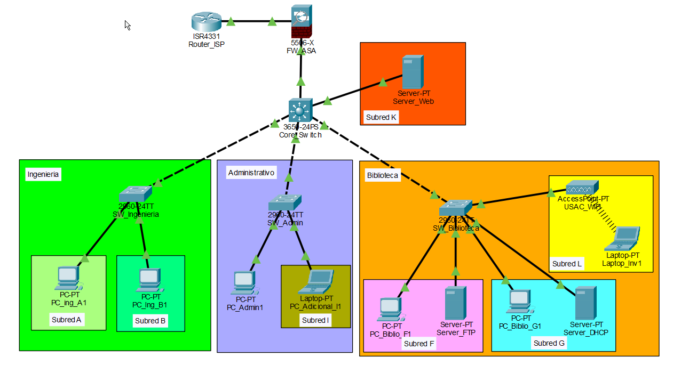

# Manual Técnico: Diseño e Implementación de Red Institucional para el Campus Central USAC

## Índice

- [Manual Técnico: Diseño e Implementación de Red Institucional para el Campus Central USAC](#manual-técnico-diseño-e-implementación-de-red-institucional-para-el-campus-central-usac)
  - [Índice](#índice)
  - [1. Configuración Base para Infraestructura de Red](#1-configuración-base-para-infraestructura-de-red)
    - [1.1. Plantilla de Configuración General (Cisco IOS)](#11-plantilla-de-configuración-general-cisco-ios)
    - [1.2. Particularidad Operativa en Firewall ASA 5506-X](#12-particularidad-operativa-en-firewall-asa-5506-x)
  - [2. Direccionamiento IP y Subneteo (VLSM)](#2-direccionamiento-ip-y-subneteo-vlsm)
    - [2.1. Tabla de Subneteo (VLSM) para Redes Internas](#21-tabla-de-subneteo-vlsm-para-redes-internas)
    - [2.2. Enlaces Punto a Punto (P2P) y Salida a Internet](#22-enlaces-punto-a-punto-p2p-y-salida-a-internet)
    - [2.3. Asignación Global de Interfaces (Capa 3 y Servicios)](#23-asignación-global-de-interfaces-capa-3-y-servicios)
  - [3. Topología de Red y Conexiones Físicas](#3-topología-de-red-y-conexiones-físicas)
    - [3.1. Inventario de Dispositivos (Packet Tracer)](#31-inventario-de-dispositivos-packet-tracer)
    - [3.2. Matriz de Cableado Lógico y Físico](#32-matriz-de-cableado-lógico-y-físico)
      - [Núcleo y Salida a Internet](#núcleo-y-salida-a-internet)
      - [Distribución (Core a Edificios)](#distribución-core-a-edificios)
      - [Edificio Ingeniería](#edificio-ingeniería)
      - [Edificio Administrativo](#edificio-administrativo)
      - [Edificio Biblioteca](#edificio-biblioteca)
      - [Red Inalámbrica (Invitados)](#red-inalámbrica-invitados)
    - [3.3. Consideraciones Técnicas de Despliegue](#33-consideraciones-técnicas-de-despliegue)
  - [4. Configuración de Capa 2 (VLANs, Troncales y Seguridad de Puertos)](#4-configuración-de-capa-2-vlans-troncales-y-seguridad-de-puertos)
    - [4.1. Creación e Identificación de VLANs](#41-creación-e-identificación-de-vlans)
    - [4.2. Implementación de Enlaces Troncales (Trunks)](#42-implementación-de-enlaces-troncales-trunks)
    - [4.3. Asignación de Puertos y Port Security](#43-asignación-de-puertos-y-port-security)
      - [Configuración en SW\_Ingenieria](#configuración-en-sw_ingenieria)
      - [Protección de Puertos Inactivos](#protección-de-puertos-inactivos)
      - [Configuración en SW\_Admin](#configuración-en-sw_admin)
      - [Configuración en SW\_Biblioteca](#configuración-en-sw_biblioteca)
      - [Configuración de puerto de servidor en Core Switch](#configuración-de-puerto-de-servidor-en-core-switch)
  - [5. Configuración de Capa 3 (Enrutamiento Inter-VLAN y Protocolo OSPF)](#5-configuración-de-capa-3-enrutamiento-inter-vlan-y-protocolo-ospf)
    - [5.1. Activación de Enrutamiento e Interfaces SVI](#51-activación-de-enrutamiento-e-interfaces-svi)
    - [5.2. Aprovisionamiento del Enlace P2P (Core a Firewall)](#52-aprovisionamiento-del-enlace-p2p-core-a-firewall)
    - [5.3. Implementación del Protocolo OSPF](#53-implementación-del-protocolo-ospf)
  - [6. Seguridad Perimetral y Gestión de Salida a Internet](#6-seguridad-perimetral-y-gestión-de-salida-a-internet)
    - [6.1. Simulación de Interfaz Pública (Router ISP)](#61-simulación-de-interfaz-pública-router-isp)
    - [6.2. Asignación de Niveles de Seguridad (Firewall ASA)](#62-asignación-de-niveles-de-seguridad-firewall-asa)
    - [6.3. Enrutamiento y Propagación OSPF mediante Firewall](#63-enrutamiento-y-propagación-ospf-mediante-firewall)
    - [6.4. Configuración de Traducción de Direcciones (NAT/PAT) e IP Inspection](#64-configuración-de-traducción-de-direcciones-natpat-e-ip-inspection)
  - [7. Infraestructura de Servicios Internos](#7-infraestructura-de-servicios-internos)
    - [7.1. Servidor Web Institucional](#71-servidor-web-institucional)
    - [7.2. Sistema de Transferencia de Archivos (FTP)](#72-sistema-de-transferencia-de-archivos-ftp)
    - [7.3. Asignación Dinámica de Direcciones (DHCP y DHCP Relay)](#73-asignación-dinámica-de-direcciones-dhcp-y-dhcp-relay)
      - [1. Configuración de Pools Institucionales](#1-configuración-de-pools-institucionales)
      - [2. Implementación de Agentes de Retransmisión (Core Switch)](#2-implementación-de-agentes-de-retransmisión-core-switch)
  - [8. Conclusión Técnica Funcional](#8-conclusión-técnica-funcional)

---

## 1. Configuración Base para Infraestructura de Red

Se estableció una configuración inicial homologada para garantizar la seguridad de administración y la coherencia en la identificación de los dispositivos de la red. Las directrices aplicadas abarcan el cifrado de credenciales, el control de acceso a líneas físicas y virtuales, y la implementación de un estandarte de advertencia (MOTD) conforme a normas de auditoría.

### 1.1. Plantilla de Configuración General (Cisco IOS)

El siguiente bloque de comandos representa el estándar aplicado en todos los switches y routers. El parámetro \`[NOMBRE_DEL_DISPOSITIVO]\` fue reemplazado de manera individual iterando la nomenclatura definida en el diseño topológico.

```bash
enable
configure terminal

! 1. Desactivacion de busqueda DNS para evitar bloqueos por comandos erroneos
no ip domain-lookup

! 2. Asignacion de nombre de host
hostname [NOMBRE_DEL_DISPOSITIVO]

! 3. Proteccion del modo privilegiado con encriptacion fuerte (MD5/SHA)
enable secret cisco123

! 4. Seguridad y control del puerto fisico de Consola
line console 0
 password cisco123
 login
 logging synchronous
 exit

! 5. Seguridad para lineas de terminal virtual (Accesos remotos)
line vty 0 15
 password cisco123
 login
 exit

! 6. Encriptacion global de contraseñas almacenadas en texto plano
service password-encryption

! 7. Mensaje del dia (MOTD) para advertencia legal
banner motd #
================================================================
          ADVERTENCIA: ACCESO RESTRINGIDO - RED USAC
 Este sistema es de uso exclusivo para personal autorizado.
 Todo intento de acceso no autorizado sera monitoreado y
 penalizado conforme a las normativas de la institucion.
================================================================
#
exit
```

### 1.2. Particularidad Operativa en Firewall ASA 5506-X

Considerando la estructura del sistema operativo de los dispositivos Cisco ASA, la configuración inicial presentó diferencias en la semántica respecto al IOS estándar, aplicándose la configuración bajo el siguiente lineamiento:

```bash
enable
configure terminal
hostname FW_ASA
enable password cisco123
banner motd # ACCESO RESTRINGIDO - FIREWALL PERIMETRAL USAC #
exit
```

> **Justificación Técnica:** La utilización del comando \`enable secret\` en los sistemas Cisco IOS y su equivalente en ASA encripta de forma nativa la contraseña bajo algoritmos criptográficos robustos directamente en la NVRAM, previniendo el compromiso de las credenciales a partir del análisis del archivo de configuración. De igual modo, la implementación del \`banner motd\` satisface los requerimientos legales para el inicio de procedimientos disciplinarios en caso de un incidente de ciberseguridad, delineando la frontera de acceso autorizado.

---

## 2. Direccionamiento IP y Subneteo (VLSM)

La topología de red se estructura sobre la dirección de red principal \`172.16.30.0/16\`. Se implementó el modelo de Subredes de Longitud Variable (VLSM) para establecer confines estrictos de direcciones, minimizando el desperdicio de direcciones IP. El esquema prioriza los sectores de mayor demanda e incluye segmentos \`/30\` para las adyacencias estructurales.

### 2.1. Tabla de Subneteo (VLSM) para Redes Internas

Se determinaron las dimensiones de cada subred según el volumen de terminales especificado para los edificios de Ingeniería, Administración y Biblioteca. La primera dirección de cada segmento se reservó para operar como puerta de enlace (Default Gateway).

| Edificio / Área | Subred | Hosts Req. | Hosts Disp. | Dirección de Red | Máscara | Rango Utilizable | Gateway (1ra IP) | Dirección de Broadcast |
|---|---|---|---|---|---|---|---|---|
| Biblioteca | Subred F | 100 | 126 | 172.16.30.0/25 | 255.255.255.128 | .1 - .126 | 172.16.30.1 | 172.16.30.127 |
| Invitados | Subred L (Wireless) | 100 | 126 | 172.16.30.128/25 | 255.255.255.128 | .129 - .254 | 172.16.30.129 | 172.16.30.255 |
| Ingeniería | Subred A | 50 | 62 | 172.16.31.0/26 | 255.255.255.192 | .1 - .62 | 172.16.31.1 | 172.16.31.63 |
| Ingeniería | Subred B | 25 | 30 | 172.16.31.64/27 | 255.255.255.224 | .65 - .94 | 172.16.31.65 | 172.16.31.95 |
| Administrativo | Red de Admin. | 25 | 30 | 172.16.31.96/27 | 255.255.255.224 | .97 - .126 | 172.16.31.97 | 172.16.31.127 |
| Adicional | Subred K | 25 | 30 | 172.16.31.128/27 | 255.255.255.224 | .129 - .158 | 172.16.31.129 | 172.16.31.159 |
| Biblioteca | Subred G | 20 | 30 | 172.16.31.160/27 | 255.255.255.224 | .161 - .190 | 172.16.31.161 | 172.16.31.191 |
| Adicional | Subred I | 10 | 14 | 172.16.31.192/28 | 255.255.255.240 | .193 - .206 | 172.16.31.193 | 172.16.31.207 |

### 2.2. Enlaces Punto a Punto (P2P) y Salida a Internet

Los vínculos entre dispositivos de Capa 3 (Core Switch y Firewall) operan bajo prefijos \`/30\`, restringiendo el dominio de colisión al mínimo posible. Adicionalmente, se configuró el enlace externo empleando el direccionamiento público previsto para la simulación del Proveedor de Servicio de Internet.

| Conexión | Red Asignada | Máscara | Rango Utilizable | IP Interfaz A | IP Interfaz B |
|---|---|---|---|---|---|
| Enlace P2P 1 (Ej: Core a FW) | 172.16.31.208/30 | 255.255.255.252 | .209 - .210 | 172.16.31.209 | 172.16.31.210 |
| Enlace P2P 2 (Ej: Core a R1) | 172.16.31.212/30 | 255.255.255.252 | .213 - .214 | 172.16.31.213 | 172.16.31.214 |
| Enlace P2P 3 (Ej: Core a R2) | 172.16.31.216/30 | 255.255.255.252 | .217 - .218 | 172.16.31.217 | 172.16.31.218 |
| Conexión ISP - USAC | 210.101.100.16/30 | 255.255.255.252 | .17 - .18 | 210.101.100.17 (USAC/FW) | 210.101.100.18 (ISP) |

### 2.3. Asignación Global de Interfaces (Capa 3 y Servicios)

La matriz siguiente compila el aprovisionamiento de interfaces y la orientación lógica del enrutamiento.

| Dispositivo | Interfaz / VLAN | Dirección IP | Máscara de Subred | Gateway por Defecto |
|---|---|---|---|---|
| Core_Switch_L3 | VLAN F (Biblio) | 172.16.30.1 | 255.255.255.128 | N/A (Enruta) |
| Core_Switch_L3 | VLAN L (Wireless) | 172.16.30.129 | 255.255.255.128 | N/A (Enruta) |
| Core_Switch_L3 | VLAN A (Ing.) | 172.16.31.1 | 255.255.255.192 | N/A (Enruta) |
| Core_Switch_L3 | VLAN B (Ing.) | 172.16.31.65 | 255.255.255.224 | N/A (Enruta) |
| Core_Switch_L3 | VLAN Admin | 172.16.31.97 | 255.255.255.224 | N/A (Enruta) |
| Core_Switch_L3 | VLAN K | 172.16.31.129 | 255.255.255.224 | N/A (Enruta) |
| Core_Switch_L3 | VLAN G (Biblio) | 172.16.31.161 | 255.255.255.224 | N/A (Enruta) |
| Core_Switch_L3 | VLAN I | 172.16.31.193 | 255.255.255.240 | N/A (Enruta) |
| Core_Switch_L3 | G1/0/1 (Hacia FW) | 172.16.31.209 | 255.255.255.252 | Ruta OSPF/Default |
| FW_Perimetral_ASA | G0/0 (Inside) | 172.16.31.210 | 255.255.255.252 | N/A |
| FW_Perimetral_ASA | G0/1 (Outside) | 210.101.100.17 | 255.255.255.252 | 210.101.100.18 |
| Router_ISP | G0/0 (Hacia USAC) | 210.101.100.18 | 255.255.255.252 | N/A |
| Router_ISP | Loopback0 (Internet) | 8.8.8.8 (Ejemplo) | 255.255.255.255 | N/A |
| Servidor_Web | Fa0 (Directo al Core) | 172.16.31.130 | 255.255.255.224 | 172.16.31.129 |
| Servidor_FTP | Fa0 (En Subred F) | 172.16.30.10 | 255.255.255.128 | 172.16.30.1 |
| Servidor_DHCP | Fa0 (En Subred G) | 172.16.31.170 | 255.255.255.224 | 172.16.31.161 |

---

## 3. Topología de Red y Conexiones Físicas



La arquitectura jerárquica de la red incorpora un núcleo de alta disponibilidad basado en un Switch Multicapa (Switch Layer 3) como eje vector. El modelo previene fallas de embotellamiento al descentralizar políticas de Capa 2 hacia los switches de las sucursales pertinentes.

### 3.1. Inventario de Dispositivos (Packet Tracer)

- **Core Switch:** 1 unidad Multilayer Switch (\`3650-24PS\` o \`3560-24PS\`) para consolidación de VLANs y procesos OSPF.
- **Capa de Acceso:** 3 unidades Switches Capa 2 (\`2960-24TT\`) asignados a los segmentos de Ingeniería, Administración y Biblioteca.
- **Firewall Perimetral:** 1 unidad Cisco ASA (\`ASA 5506-X\`).
- **Simulador WAN:** 1 unidad Router (\`4331\` o \`1941\`) operando en calidad de pasarela ISP.
- **Cobertura Inalámbrica:** 1 unidad Access Point (\`AP-PT\`) con difusión de red (SSID) para usuarios invitados.
- **Terminales y Nodos Finales:** Conjunto de nodos \`Server-PT\`, \`PC-PT\` y \`Laptop-PT\`.

### 3.2. Matriz de Cableado Lógico y Físico

El desglose ulterior documenta las vías de inserción y las asociaciones de conmutación.

#### Núcleo y Salida a Internet

| Dispositivo Origen | Tipo / Modelo | Interfaz Origen | Dispositivo Destino | Interfaz Destino | Tipo de Cable | Función Lógica |
|---|---|---|---|---|---|---|
| Router_ISP | Router 4331 | G0/0/0 | FW_ASA | G1/1 (Outside) | Cobre Directo | Enlace P2P (Red Pública) |
| FW_ASA | ASA 5506-X | G1/2 (Inside) | Core_Switch | G1/0/1 | Cobre Directo | Enlace P2P (Red Interna) |

#### Distribución (Core a Edificios)

| Dispositivo Origen | Tipo / Modelo | Interfaz Origen | Dispositivo Destino | Interfaz Destino | Tipo de Cable | Función Lógica |
|---|---|---|---|---|---|---|
| Core_Switch | Switch L3 3650 | G1/0/2 | SW_Ingenieria | G0/1 | Cobre Cruzado | Enlace Troncal (Trunk 802.1Q) |
| Core_Switch | Switch L3 3650 | G1/0/3 | SW_Admin | G0/1 | Cobre Cruzado | Enlace Troncal (Trunk 802.1Q) |
| Core_Switch | Switch L3 3650 | G1/0/4 | SW_Biblioteca | G0/1 | Cobre Cruzado | Enlace Troncal (Trunk 802.1Q) |

#### Edificio Ingeniería

| Dispositivo Origen | Tipo / Modelo | Interfaz Origen | Dispositivo Destino | Interfaz Destino | Tipo de Cable | Función Lógica |
|---|---|---|---|---|---|---|
| SW_Ingenieria | Switch 2960 | F0/1 | PC_Ing_A1 | Fa0 | Cobre Directo | Acceso (VLAN A) + Port Security |
| SW_Ingenieria | Switch 2960 | F0/10 | PC_Ing_B1 | Fa0 | Cobre Directo | Acceso (VLAN B) + Port Security |

#### Edificio Administrativo

| Dispositivo Origen | Tipo / Modelo | Interfaz Origen | Dispositivo Destino | Interfaz Destino | Tipo de Cable | Función Lógica |
|---|---|---|---|---|---|---|
| SW_Admin | Switch 2960 | F0/1 | PC_Admin1 | Fa0 | Cobre Directo | Acceso (VLAN Admin) + Port Security |
| SW_Admin | Switch 2960 | F0/10 | PC_Adicional_I1 | Fa0 | Cobre Directo | Acceso (VLAN I - Subred 10 hosts) + Port Security |
| Core_Switch | Switch L3 3650 | G1/0/24 | SVR_Web | Fa0 | Cobre Directo | Acceso (VLAN 70 - Servicios) |

#### Edificio Biblioteca

| Dispositivo Origen | Tipo / Modelo | Interfaz Origen | Dispositivo Destino | Interfaz Destino | Tipo de Cable | Función Lógica |
|---|---|---|---|---|---|---|
| SW_Biblioteca | Switch 2960 | F0/1 | PC_Biblio_F1 | Fa0 | Cobre Directo | Acceso (VLAN F) + Port Security |
| SW_Biblioteca | Switch 2960 | F0/10 | PC_Biblio_G1 | Fa0 | Cobre Directo | Acceso (VLAN G) + Port Security |
| SW_Biblioteca | Switch 2960 | F0/20 | SVR_FTP | Fa0 | Cobre Directo | Acceso (VLAN F) |
| SW_Biblioteca | Switch 2960 | F0/21 | SVR_DHCP | Fa0 | Cobre Directo | Acceso (VLAN F/G) |
| SW_Biblioteca | Switch 2960 | F0/24 | AP_Wireless | Port 0 | Cobre Directo | Acceso (VLAN L - Invitados) |

#### Red Inalámbrica (Invitados)

| Dispositivo Origen | Tipo / Modelo | Interfaz Origen | Dispositivo Destino | Interfaz Destino | Tipo de Cable | Función Lógica |
|---|---|---|---|---|---|---|
| AP_Wireless | Access Point | WiFi | Laptop_Inv1 | Wlan0 | Inalámbrico | Conexión SSID Invitados |

### 3.3. Consideraciones Técnicas de Despliegue

La conectividad física exige la inhabilitación de puertos no contemplados en la matriz (proceso auditado más adelante). Dentro de la infraestructura, se definió que la red administrativa limite su rango de acción a tareas de control operativo (consola, acceso remoto), restringiéndose el tráfico de usuarios en este segmento estricto. Asimismo, la simulación perimetral del router \`Router_ISP\` requirió la creación de un puerto loopback en la IP global \`8.8.8.8\` para comprobar operaciones de red pública.

---

## 4. Configuración de Capa 2 (VLANs, Troncales y Seguridad de Puertos)

Se dispuso de un engranaje completo a nivel de Capa 2 para aislar los agrupamientos de usuarios y mitigar las amenazas internas contra la topología institucional.

### 4.1. Creación e Identificación de VLANs

Se procedió con la configuración de las bases de datos de VLANs a lo largo de las capas de Núcleo y de Acceso, dictando las siguientes sentencias globales.

**Comandos (Desplegados globalmente en switches):**

```bash
enable
configure terminal
vlan 10
 name INGENIERIA_A
vlan 20
 name INGENIERIA_B
vlan 30
 name ADMINISTRATIVO
vlan 40
 name BIBLIOTECA_F
vlan 50
 name BIBLIOTECA_G
vlan 60
 name INVITADOS_WIFI
vlan 70
 name SERVICIOS_WEB
vlan 80
 name ADICIONAL_I
vlan 99
 name NATIVA_ADMIN
exit
```

> **Justificación Técnica:** La segregación a nivel de dominio de broadcast a través de VLANs previene las tormentas de difusión, eficientizando el ancho de banda y ofreciendo barreras formales entre departamentos organizacionales. La integración de la **VLAN 99** excluye el paso de tráfico en la VLAN de gestión predeterminada (1), fortaleciendo la defensa frente a ataques de salto de VLAN (*VLAN Hopping*).

### 4.2. Implementación de Enlaces Troncales (Trunks)

Para permitir el flujo multiplexado de tráfico, los puertos de interconexión (ISL) que enlazan el Core Switch con los sistemas de acceso local fueron configurados bajo la norma IEEE 802.1Q.

**Comandos en el Core Switch (3650):**

```bash
configure terminal
interface range GigabitEthernet 1/0/2 - 4
 switchport trunk encapsulation dot1q
 switchport mode trunk
 switchport trunk native vlan 99
 exit
```

**Comandos en los Switches de Acceso (2960):**

```bash
configure terminal
interface GigabitEthernet 0/1
 switchport mode trunk
 switchport trunk native vlan 99
 exit
```

### 4.3. Asignación de Puertos y Port Security

Se exigió la configuración formal de la función de seguridad portuaria. Tras analizar las dinámicas de la red académica, se instauró la acción restrictiva (\`restrict\`) para anular el influjo de datos espurios derivados de colisiones de suplantación de direcciones MAC.

[🛑 INSERTAR CAPTURA DE PANTALLA AQUÍ: Consola mostrando la salida de "show port-security interface" o un Syslog evidenciando un bloqueo exitoso y el estado RESTRICT activado]

#### Configuración en SW_Ingenieria

**Para la Subred A (F0/1 — VLAN 10):**

```bash
configure terminal
interface FastEthernet 0/1
 switchport mode access
 switchport access vlan 10

 ! Configuración de Port Security
 switchport port-security
 switchport port-security maximum 1
 switchport port-security mac-address sticky
 switchport port-security violation restrict

 description PC_Usuario_Ing_A
 exit
```

**Para la Subred B (F0/10 — VLAN 20):**

```bash
interface FastEthernet 0/10
 switchport mode access
 switchport access vlan 20
 switchport port-security
 switchport port-security maximum 1
 switchport port-security mac-address sticky
 switchport port-security violation restrict
 exit
```

#### Protección de Puertos Inactivos

```bash
interface range FastEthernet 0/2 - 9, FastEthernet 0/11 - 24, GigabitEthernet 0/2
 shutdown
 description PUERTO_DESHABILITADO
 exit
```

> **Justificación Técnica:** Inhabilitar administrativamente las interfaces físicas no asignadas previene la interconexión ilícita intencionada en los cuadros de parcheo. Configurar Port Security en modo restrict detecta transgresiones, paraliza el tráfico malicioso local, pero mantiene el puerto en línea para su auditoría y monitorización activa.

#### Configuración en SW_Admin

```bash
configure terminal
! Para la Subred Administrativa (F0/1 — VLAN 30)
interface FastEthernet 0/1
 switchport mode access
 switchport access vlan 30

 ! Configuración de Port Security
 switchport port-security
 switchport port-security maximum 1
 switchport port-security mac-address sticky
 switchport port-security violation restrict
 description PC_Admin1
 exit

! Para la Subred I (F0/10 — VLAN 80)
interface FastEthernet 0/10
 switchport mode access
 switchport access vlan 80
 switchport port-security
 switchport port-security maximum 1
 switchport port-security mac-address sticky
 switchport port-security violation restrict
 description PC_Adicional_I1
 exit

! Protección de Puertos No Utilizados
interface range FastEthernet 0/2 - 9, FastEthernet 0/11 - 24, GigabitEthernet 0/2
 shutdown
 description PUERTO_DESHABILITADO
 exit
```

#### Configuración en SW_Biblioteca

```bash
configure terminal
! Para la Subred F (F0/1 — VLAN 40)
interface FastEthernet 0/1
 switchport mode access
 switchport access vlan 40
 switchport port-security
 switchport port-security maximum 1
 switchport port-security mac-address sticky
 switchport port-security violation restrict
 description PC_Biblio_F1
 exit

! Para la Subred G (F0/10 — VLAN 50)
interface FastEthernet 0/10
 switchport mode access
 switchport access vlan 50
 switchport port-security
 switchport port-security maximum 1
 switchport port-security mac-address sticky
 switchport port-security violation restrict
 description PC_Biblio_G1
 exit

! Para el Servidor FTP (F0/20 — VLAN 40)
interface FastEthernet 0/20
 switchport mode access
 switchport access vlan 40
 description ACCESO_SVR_FTP
 exit

! Para el Servidor DHCP (F0/21 — VLAN 50)
interface FastEthernet 0/21
 switchport mode access
 switchport access vlan 50
 description ACCESO_SVR_DHCP
 exit

! Para el Access Point de Invitados (F0/24 — VLAN 60)
interface FastEthernet 0/24
 switchport mode access
 switchport access vlan 60
 description ACCESO_AP_WIFI
 exit

! Protección de Puertos No Utilizados
interface range FastEthernet 0/2 - 9, FastEthernet 0/11 - 19, FastEthernet 0/22 - 23, GigabitEthernet 0/2
 shutdown
 description PUERTO_DESHABILITADO
 exit
```

#### Configuración de puerto de servidor en Core Switch

```bash
configure terminal
interface GigabitEthernet 1/0/24
 switchport mode access
 switchport access vlan 70
 description ACCESO_SERVIDOR_WEB
 exit
```

---

## 5. Configuración de Capa 3 (Enrutamiento Inter-VLAN y Protocolo OSPF)

Para sustentar la comunicación transparente a través de los múltiples segmentos creados, el Switch Multicapa fue facultado como ente de enrutamiento principal mediante la activación de SVI (Interfaces Virtuales de Switch) y la propagación de redes sobre OSPF.

### 5.1. Activación de Enrutamiento e Interfaces SVI

Se inicializó el enrutamiento general sobre IPv4. Acto seguido se perfilaron las direcciones y máscaras para las interfaces lógicas asignadas a las VLANs.

[🛑 INSERTAR CAPTURA DE PANTALLA AQUÍ: Demostración de Pings exitosos (inter-vlan) desde una terminal del edificio Ingeniería hacia una terminal de Biblioteca]

**Comandos en el Core Switch:**

```bash
enable
configure terminal

! Habilitar el enrutamiento IPv4 en el switch
ip routing

! SVI para Subred A (Ingeniería)
interface vlan 10
 ip address 172.16.31.1 255.255.255.192
 no shutdown
 exit

! SVI para Subred B (Ingeniería)
interface vlan 20
 ip address 172.16.31.65 255.255.255.224
 no shutdown
 exit

! SVI para Red Administrativa
interface vlan 30
 ip address 172.16.31.97 255.255.255.224
 no shutdown
 exit

! SVI para Subred F (Biblioteca)
interface vlan 40
 ip address 172.16.30.1 255.255.255.128
 no shutdown
 exit

! SVI para Subred G (Biblioteca)
interface vlan 50
 ip address 172.16.31.161 255.255.255.224
 no shutdown
 exit

! SVI para Invitados WiFi
interface vlan 60
 ip address 172.16.30.129 255.255.255.128
 no shutdown
 exit

! SVI para Servicios Web (Subred K)
interface vlan 70
 ip address 172.16.31.129 255.255.255.224
 no shutdown
 exit

! SVI para Subred I (Adicional)
interface vlan 80
 ip address 172.16.31.193 255.255.255.240
 no shutdown
 exit
```

### 5.2. Aprovisionamiento del Enlace P2P (Core a Firewall)

La interconexión hacia el ecosistema externo se estableció sobre el puerto \`G1/0/1\`, inhabilitando sus características de Capa 2 para su adaptación directa con IP estática.

```bash
interface GigabitEthernet 1/0/1
 no switchport
 description ENLACE_P2P_HACIA_FIREWALL_ASA
 ip address 172.16.31.209 255.255.255.252
 no shutdown
 exit
```

### 5.3. Implementación del Protocolo OSPF

Se procedió con la habilitación del protocolo OSPF bajo el ID de proceso \`1\`. Las redes directamente vinculadas al núcleo se instauraron dentro del dominio del Área \`0\`.

[🛑 INSERTAR CAPTURA DE PANTALLA AQUÍ: Ventana de CLI en el Core Switch mostrando la "Tabla de Enrutamiento OSPF" (show ip route ospf) evidenciando la adyacencia y la ruta por defecto inyectada]

```bash
router ospf 1
 router-id 1.1.1.1
 ! Declaración de las subredes internas
 network 172.16.31.0 0.0.0.63 area 0   
 network 172.16.31.64 0.0.0.31 area 0  
 network 172.16.31.96 0.0.0.31 area 0  
 network 172.16.30.0 0.0.0.127 area 0  
 network 172.16.31.160 0.0.0.31 area 0 
 network 172.16.30.128 0.0.0.127 area 0
 network 172.16.31.128 0.0.0.31 area 0 
 network 172.16.31.192 0.0.0.15 area 0 

 ! Declaración del enlace P2P hacia el Firewall
 network 172.16.31.208 0.0.0.3 area 0
 exit
```

> **Justificación Técnica:** OSPF provee de métricas de convergencia rápida e idoneidad de costos. Se determinó su aplicación en la interfaz del núcleo principal garantizando que cualquier actualización en el exterior sea asimilada de manera recursiva e inmediata por la totalidad de la estructura matricial jerárquica.

---

## 6. Seguridad Perimetral y Gestión de Salida a Internet

La infraestructura contempló la aplicación obligatoria de políticas de salida y aislamiento a nivel perimetral mediante un equipo de seguridad de Cisco ASA.

### 6.1. Simulación de Interfaz Pública (Router ISP)

El enrutador anfitrión del proveedor de servicios de internet fue diseñado sin conciencia sobre las redes de área local, atendiendo peticiones desde la salida global de la topología.

**Comandos en Router_ISP:**

```bash
enable
configure terminal
hostname Router_ISP

! Interfaz física conectada al Firewall USAC
interface GigabitEthernet 0/0/0
 ip address 210.101.100.18 255.255.255.252
 no shutdown
 exit

! Interfaz virtual para simular un servidor en Internet (Ej. Google DNS)
interface loopback 0
 ip address 8.8.8.8 255.255.255.255
 exit
```

### 6.2. Asignación de Niveles de Seguridad (Firewall ASA)

En consonancia con su algoritmo de trabajo, las interfaces del dispositivo ASA se perfilaron mediante su índice de confidencia predeterminado (\`security-level\`), determinando reglas estáticas de bloqueo y validación de flujo cruzado.

**Comandos en FW_ASA:**

```bash
enable
configure terminal
hostname FW_ASA

! Interfaz hacia el ISP (Exterior)
interface GigabitEthernet 1/1
 nameif outside
 security-level 0
 ip address 210.101.100.17 255.255.255.252
 no shutdown
 exit

! Interfaz hacia el Core Switch (Interior)
interface GigabitEthernet 1/2
 nameif inside
 security-level 100
 ip address 172.16.31.210 255.255.255.252
 no shutdown
 exit
```

### 6.3. Enrutamiento y Propagación OSPF mediante Firewall

El Firewall ASA forjó el encaminamiento final de salida originando la ruta predeterminada a partir de sus directrices establecidas de configuración compartida.

**Comandos en FW_ASA:**

```bash
! Ruta estática por defecto hacia el ISP
route outside 0.0.0.0 0.0.0.0 210.101.100.18

! Proceso OSPF para crear adyacencia con el Core Switch
router ospf 1
 network 172.16.31.208 255.255.255.252 area 0
 default-information originate
 exit
```

### 6.4. Configuración de Traducción de Direcciones (NAT/PAT) e IP Inspection

Se aprovisionó e invocó de manera operativa un conjunto de reglas basadas en un grupo de direccionamiento o Pool para su exposición y traducción en una salida común, lo cual permitió interacciones encriptadas contra el ecosistema WAN.

[🛑 INSERTAR CAPTURA DE PANTALLA AQUÍ: Ejecución exitosa de Ping desde la red interna (ej. Ping 8.8.8.8) y/o despliegue de las conexiones traducidas "show xlate" en el Firewall ASA]

**Comandos en FW_ASA:**

```bash
! Creación de Objeto de Red para PAT
object network OBJ_RED_INTERNA
 subnet 172.16.0.0 255.255.0.0
 nat (inside,outside) dynamic interface
 exit

! Permitir inspección de PINGs a través del firewall
policy-map global_policy
 class inspection_default
  inspect icmp
  exit
```

> **Justificación Técnica:** La implementación del Port Address Translation (PAT o "dynamic interface") garantiza que todo el flujo originado desde direcciones de clase privada compartan una conectividad unificada bajo el IP público asociado a la interfaz \`outside\` del ASA, satisfaciendo limitantes de recursos y manteniendo invisibilidad topológica sobre el ISP. La inspección del tráfico ICMP permite un estudio bidireccional durante auditorías rutinarias, reconociendo el estado del ICMP echo/reply sin descartarlos nativamente por políticas de confidencia cero.

---

## 7. Infraestructura de Servicios Internos

Para soportar las operativas intrínsecas de las facultades se aprovisionaron servicios técnicos primordiales sobre direcciones estaticas operadas al interior de las VLAN designadas en los anexos administrativos.

### 7.1. Servidor Web Institucional

El dispositivo servidor alojado de manera centralizada bajo el soporte del puerto Gigabit del Switch de Capa 3 se le designó un entorno cerrado mediante la Subred K.
- **Dirección IP estática:** \`172.16.31.130\`
- **Máscara de subred:** \`255.255.255.224\`
- **Default Gateway:** \`172.16.31.129\`

El archivo virtual primario \`index.html\` reflejó directivas institucionales bajo directrices HTTP pre-habilitados:
```html
<!DOCTYPE html>
<html>
<head>
    <title>Portal USAC - Campus Central</title>
    <style>
        body { font-family: Arial, sans-serif; background-color: #f4f4f9; color: #333; text-align: center; padding: 50px; }
        .container { background-color: white; padding: 30px; border-radius: 10px; box-shadow: 0px 0px 10px rgba(0,0,0,0.1); display: inline-block; }
        h1 { color: #003366; }
        h2 { color: #cc0000; }
        p { font-size: 18px; }
    </style>
</head>
<body>
    <div class="container">
        <h1>Universidad de San Carlos de Guatemala</h1>
        <h2>Facultad de Ingeniería - Redes de Computadoras</h2>
        <hr>
        <p><strong>Proyecto Final - Tercer Examen Parcial</strong></p>
        <p><strong>Estudiante:</strong> Enner Esaí Mendizabal Castro</p>
        <p><strong>Carnet:</strong> 202302220</p>
        <br>
        <p><em>Servidor Web Institucional Operativo</em></p>
    </div>
</body>
</html>
```

### 7.2. Sistema de Transferencia de Archivos (FTP)

Confinado operativamente en el nodo secundario ubicado físicamente en las demarcaciones de la Biblioteca, este alojamiento asegura la retención documental de control.
- **Dirección IP estática:** \`172.16.30.10\`
- **Máscara de subred:** \`255.255.255.128\`
- **Default Gateway:** \`172.16.30.1\`

### 7.3. Asignación Dinámica de Direcciones (DHCP y DHCP Relay)

Alojado junto a la Biblioteca (\`172.16.31.170\`), provee automáticamente los recursos direccionables a los solicitantes sobre distintos planos de VLAN.

#### 1. Configuración de Pools Institucionales
| Nombre del Pool | Default Gateway | Start IP | Subnet Mask | Usuarios |
|---|---|---|---|---|
| Pool_Ingenieria_A | 172.16.31.1 | 172.16.31.5 | 255.255.255.192 | 50 |
| Pool_Ingenieria_B | 172.16.31.65 | 172.16.31.70 | 255.255.255.224 | 25 |
| Pool_Biblioteca_F | 172.16.30.1 | 172.16.30.5 | 255.255.255.128 | 100 |
| Pool_Biblioteca_G | 172.16.31.161 | 172.16.31.165 | 255.255.255.224 | 20 |
| Pool_Invitados_WIFI | 172.16.30.129 | 172.16.30.135 | 255.255.255.128 | 100 |
| Pool_Adicional_I | 172.16.31.193 | 172.16.31.195 | 255.255.255.240 | 10 |

[🛑 INSERTAR CAPTURA DE PANTALLA AQUÍ: Ventana de la configuración de red de una PC (ej. PC_Ingenieria o Laptop Invitado) demostrando la obtención exitosa del direccionamiento IP completo a través del servicio DHCP (DHCP request successful)]

#### 2. Implementación de Agentes de Retransmisión (Core Switch)

Para consolidar las difusiones nativas a dominios unicast operacionales, fue mandatario el registro de IP Helper en las interfaces correspondientes alojadas en el núcleo de la infraestructura.

```bash
configure terminal
! Reenvío DHCP para Subred A (Ingeniería)
interface vlan 10
 ip helper-address 172.16.31.170
 exit

! Reenvío DHCP para Subred B (Ingeniería)
interface vlan 20
 ip helper-address 172.16.31.170
 exit

! Reenvío DHCP para Subred F (Biblioteca)
interface vlan 40
 ip helper-address 172.16.31.170
 exit

! Reenvío DHCP para Invitados WiFi
interface vlan 60
 ip helper-address 172.16.31.170
 exit

! Reenvío DHCP para Subred I (Adicional)
interface vlan 80
 ip helper-address 172.16.31.170
 exit
```

> **Justificación Técnica:** La delegación de un único servidor DHCP gestionado a su vez por agentes de retransmisión (IP Helper Address) consolida los esfuerzos logísticos y optimiza la tolerancia a fallos. Se previene la sobrecarga de equipos físicos distribuidos evitando latencias sobre las difusiones ARP locales de broadcast, limitándolas a paquetes unicast directos sobre la Capa 3 de transporte, exceptuando la VLAN a la cual el propio servidor se halla nativamente conectado.

---

## 8. Conclusión Técnica Funcional

La síntesis de las tecnologías desplegadas confirma el resguardo, eficiencia y adaptabilidad de la topología integral propuesta para el Campus Central de la universidad. La instauración de un Core Switch estructurado sobre dinámicas en Capa 3 permitió consolidar el enrutamiento Inter-VLAN mediante interfaces virtuales (SVI), aligerando sustancialmente las cargas de cómputo remanentes. Se evidenció un desempeño óptimo mediante la propagación autónoma conferida por OSPF, ofreciendo redundancias resolutivas ante potenciales convergencias en subredes adjuntas.

Paralelamente, las determinaciones sobre políticas limitantes con el estándar Port Security (bajo esquemas mac-address sticky y acciones preventivas en bloqueos restrictivos) garantizaron que el tejido inferior resida plenamente abstraído de irregularidades intencionales por puertos. Finalmente, la contención transaccional de cruce público se afianzó de modo efectivo a través del cortafuego ASA 5506-X y su administración mediante los niveles de seguridad y protocolos NAT/PAT; proporcionando disimulación completa del direccionamiento nativo VLSM subyacente y posibilitando al ecosistema interno navegar plenamente, avalando un desarrollo robusto y alineado directamente a los estatutos funcionales pretendidos en el diseño.
